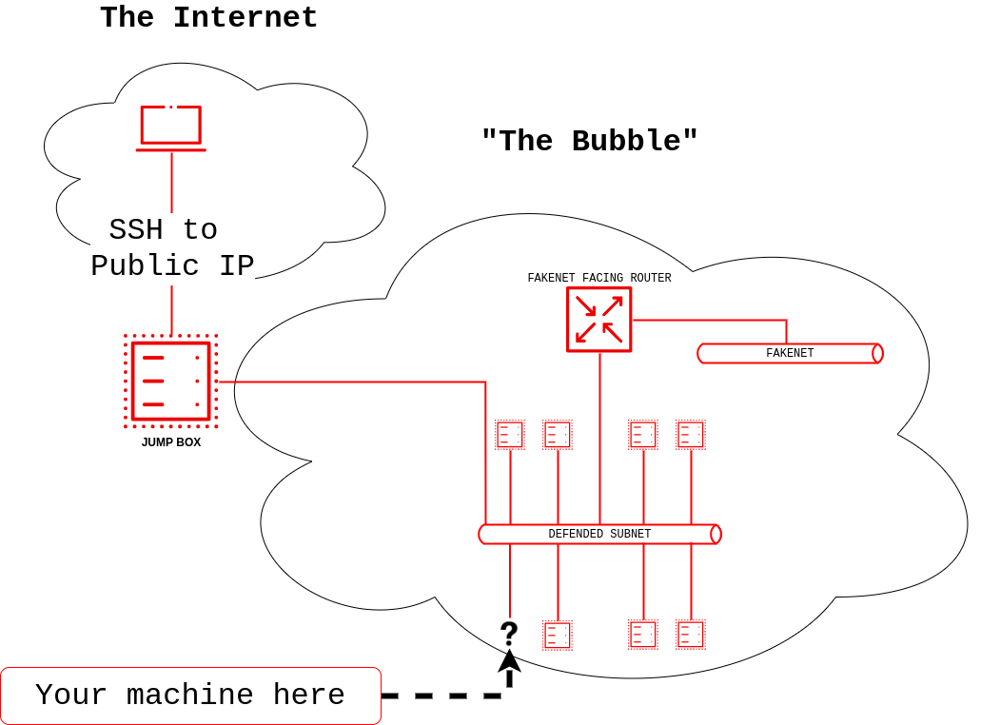

# Collaborative Cyber Range Workshop
The goal of this workshop is to use an established CI/CD pipeline via Github Actions to add your virtual machine to a network of already running virtual machines.

At a high level, it looks like this:
1. Fork this repository
2. Edit `testrange/terraform.tfvars` and add your system to the list of vms.
3. Submit a pull request to this repository.  When it is accepted and merged, the CI/CD pipeline will trigger and you should be able to SSH into your machine when it completes.



## Bare Minimum to Complete the Lab
You will need a Github account in order to submit a pull request.  
1. On the main page of this repository, click "Fork" and select your account name as the place to fork to.  For more information, take a look at the docs: https://docs.github.com/en/github/getting-started-with-github/fork-a-repo
2. Edit the `testrange/terraform.tfvars` file to insert your machine.  Try to order it where it makes sense.  
At minimum, you will need to edit 3 properties:
* key value ( this should be the same as the "name" value and is the string least indented
* name ( testvm5 in our example )
* ipv4_address (10.10.10.155 in our example)
* mac_address (00:50:56:AA:BB:D5)  
For example, if you were asked to add testvm5, it might look like this:

Snippet before adding `testvm5`:
```
 testvm4 = {
    name      = "testvm4"
    customize = true
    template  = "centos7"
    num_cpus  = 2
    memory    = 4096
    network = {
      Default = {
        network_id   = "Default"
        ipv4_address = "10.10.10.154"
        netmask      = "24"
        mac_address  = "00:50:56:AA:BB:D4"
      }
    }
    gateway         = "10.10.10.254"
    dns_server_list = ["10.10.10.254"]
    domain_suffix   = "frostbytes.io"
    extra_config = [
      "#!/bin/bash"
    ]
  },
  vyos01 = {
    name      = "vyos01"
    customize = false
    template  = "vyos"
    num_cpus  = 2
    memory    = 4096
    network = {
      Default = {
        network_id   = "Default"
        ipv4_address = "10.10.10.9"
        netmask      = "24"
        mac_address  = "00:50:56:AA:BB:D9"
      }
    }
    gateway         = "10.10.10.254"
    dns_server_list = ["10.10.10.254"]
    domain_suffix   = "frostbytes.io"
    extra_config = [
      "#!/bin/bash",
      "set interfaces ethernet eth0 address 10.10.10.9/24",
      "set interfaces ethernet eth0 hw-id 00:50:56:AA:BB:D3",
      "set protocols static route 0.0.0.0/0 next-hop 10.10.10.254",
      "set system name-server 8.8.8.8"
    ]
  }
}
```
Snippet after adding `testvm5`
```
 testvm4 = {
    name      = "testvm4"
    customize = true
    template  = "centos7"
    num_cpus  = 2
    memory    = 4096
    network = {
      Default = {
        network_id   = "Default"
        ipv4_address = "10.10.10.154"
        netmask      = "24"
        mac_address  = "00:50:56:AA:BB:D4"
      }
    }
    gateway         = "10.10.10.254"
    dns_server_list = ["10.10.10.254"]
    domain_suffix   = "frostbytes.io"
    extra_config = [
      "#!/bin/bash"
    ]
  },
   testvm5 = {
    name      = "testvm5"
    customize = true
    template  = "centos7"
    num_cpus  = 2
    memory    = 4096
    network = {
      Default = {
        network_id   = "Default"
        ipv4_address = "10.10.10.155"
        netmask      = "24"
        mac_address  = "00:50:56:AA:BB:D5"
      }
    }
    gateway         = "10.10.10.254"
    dns_server_list = ["10.10.10.254"]
    domain_suffix   = "frostbytes.io"
    extra_config = [
      "#!/bin/bash"
    ]
  },
  vyos01 = {
    name      = "vyos01"
    customize = false
    template  = "vyos"
    num_cpus  = 2
    memory    = 4096
    network = {
      Default = {
        network_id   = "Default"
        ipv4_address = "10.10.10.9"
        netmask      = "24"
        mac_address  = "00:50:56:AA:BB:D9"
      }
    }
    gateway         = "10.10.10.254"
    dns_server_list = ["10.10.10.254"]
    domain_suffix   = "frostbytes.io"
    extra_config = [
      "#!/bin/bash",
      "set interfaces ethernet eth0 address 10.10.10.9/24",
      "set interfaces ethernet eth0 hw-id 00:50:56:AA:BB:D3",
      "set protocols static route 0.0.0.0/0 next-hop 10.10.10.254",
      "set system name-server 8.8.8.8"
    ]
  }
}
```
3. When you commit your change, you'll have to include a comment about the commit.  Mention that you are adding a specific machine.
4. Finally, open a pull request.  You'll want to submit against the `infrabuildxyz/rangebuildworkshop` `main` branch with your repos working branch as the `HEAD` branch.  For more guidance on how to do this, the docs are here: https://docs.github.com/en/github/collaborating-with-issues-and-pull-requests/creating-a-pull-request-from-a-fork
5. One you've submitted a pull request, flag someone down in chat and we'll take a look at the pull request for sanity then approve it.  You'll be able to see your code run here: https://github.com/infrabuildxyz/rangebuildworkshop/actions
6. Access your machine through the jumpbox.  For example, if I was logging into `testvm5` created above, it would look like this `ssh -J sysadmin@147.75.61.133 sysadmin@10.10.10.155`.  Ask in chat for the default password.

